# Manual de instalación del Agente de GLPI

:::info

Manual elaborado el 24 de febrero de 2026 <br/>
Actualizado: 23 de marzo de 2026 <br/>
Autor: Juande Sánchez <br/>
Correo: [soporte4@crececonvales.com](mailto://soporte4crececonvales.com) <br/>
**Versión: 0.4**

:::

El siguiente manual muestra el procedimiento de instalación y configuración para el Agente GLPI para la empresa Crece con Vales.

## Objetivos

1. Facilitar una guía sencilla de la instalación del Agente de GLPI.
2. Ayudar a mantener un inventario de los equipos de cómputo de la empresa CRECE.

## Alcances

- El presente manual esta destinado para usuarios del área de Sistemas de la empresa CRECE.
- Se incluyen procedimientos para la instalación del Agente de GLPI. Por lo cual es necesario contar con conocimientos sobre:
    - Descarga de archivos a través de un navegador web, como es **Mozilla Firefox,** **Google Chrome** o **Microsoft Edge**. En los cuales la descarga de archivos es muy similar y hacen uso de la carpeta de Descargas del perfil de usuario en Windows (*%USERPROFILE%\Downloads\*).
    - Uso de *interpretes de línea de comandos* (CLI), como **Windows PowerShell** o **CMD**, esto con la finalidad de darle al usuario un procedimiento adicional, usando **WinGet**.
        - Para el uso de este último es necesario contar por lo menos con Windows 10 22H2 y contar con el paquete **Microsoft.DesktopAppInstaller** que puede ser descargado desde la Microsoft Store.
- Por tal motivo, este manual es únicamente para equipos con Windows 10/11 y con arquitectura de procesador x86_64, por lo cual no esta provisto funcionar con ARM64 u otro sistema operativo que no sean los anteriormente descritos.
- Finalmente, se muestra como validar nuestra instalación del agente y que este configurado correctamente así como consultar el estatus del mismo y conocer las tareas planeadas y cuando se volverán a ejecutar las tareas planeadas por el agente.

## Proceso de instalación

### Método 1 - Instalación con el asistente de instalación

1. Abrir un navegador como Microsoft Edge y acceder al URL: [https://github.com/glpi-project/glpi-agent/releases](https://github.com/glpi-project/glpi-agent/releases)
2. Desde la página oficial de Github del proyecto GLPI, descargar la última versión del instalador del agente para la arquitectura x86_64 para Windows.

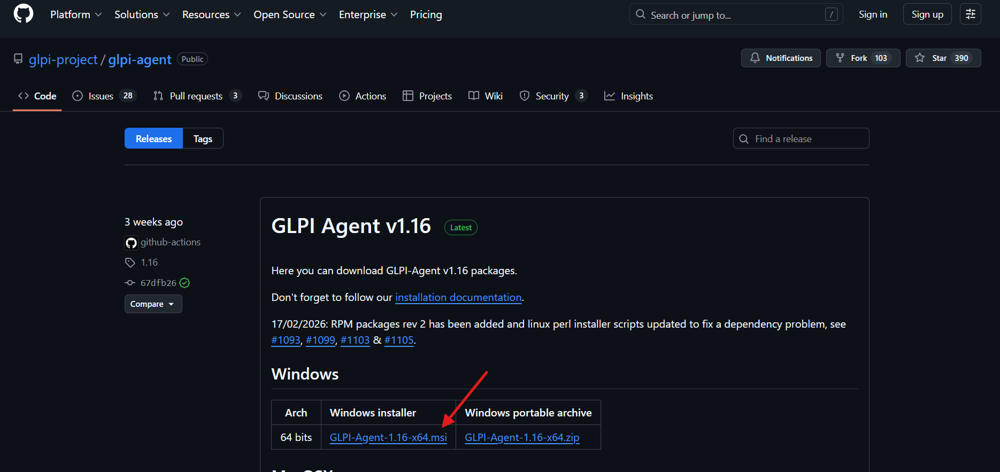

3. El navegador debe de comenzar la descarga y nos mostrará una ventana emergente indicando el progreso, velocidad de transferencia y tiempo aproximado de descarga, como la siguiente.

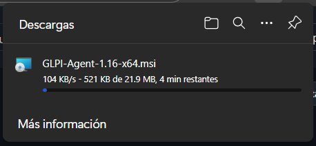

4. Una descargado el archivo instalador del agente GLPI, lo ejecutaremos dando clic en el enlace *Abrir archivo*.

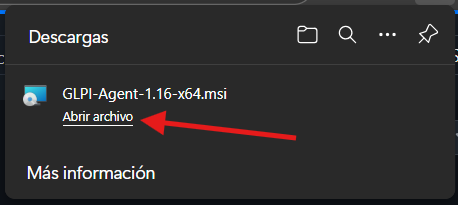

5. Esto lanzará el instalador de la aplicación. Damos clic en el botón **Next**

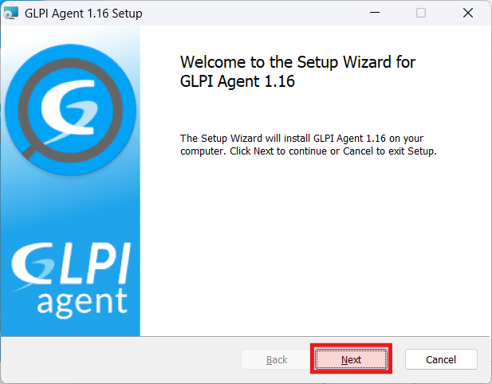

6. Nos mostrará la licencia GPL del proyecto. Damos clic en el botón **Next**.

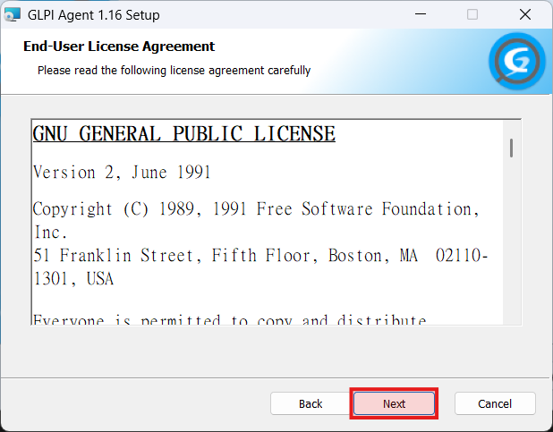

7. Nos indica la ruta donde se instalará el agente, lo dejamos tal cual como esta. Damos clic en el botón **Next**.

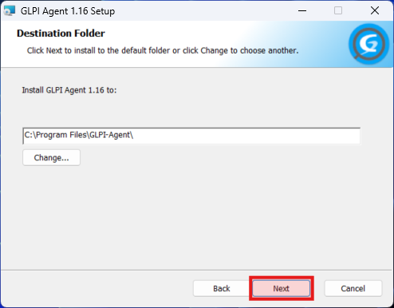

8. Para nuestro tipo de instalación, que es personalizada. Damos clic en el botón **Custom**.

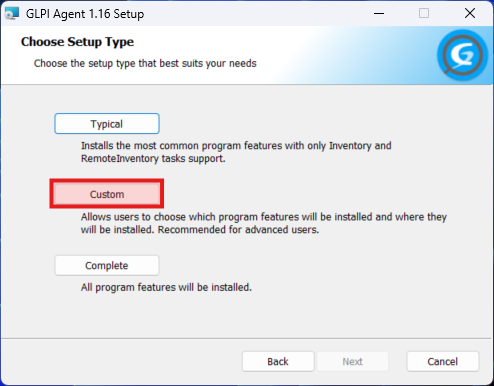

9. Tenemos que dar clic sobre el icono de disco duro y seleccionamos la opción *Entire feature will be installed on local hard drive* de las opciones que deben de estar instalar.

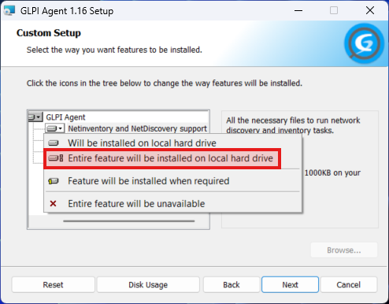

10. Las opciones que vamos a seleccionar para la personalización son:
    - NetInventory and NetDiscovery support
    - Deploy support
    - Collect support
11. Una vez seleccionadas estás tres opciones, damos clic en el botón **Next**.

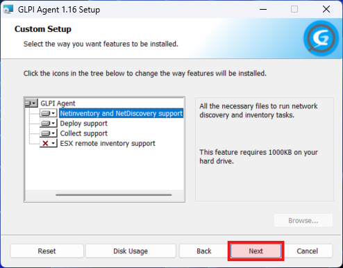

12. Nos mostrara la pantalla para seleccionar los objetivos locales y remotos para que el agente pueda levantar el inventario del equipo. En el campo de objetivo remoto (**Remote Targets**) ingresamos la dirección URL de nuestro servicio. 

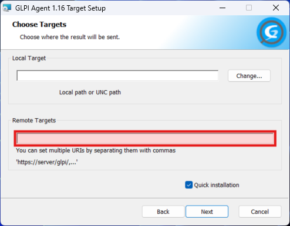

13. Escribimos la dirección URL: [https://glpi.creceenlace.com/](https://glpi.creceenlace.com/), ahora damos clic en el botón **Next**.

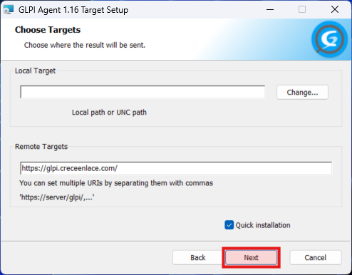

14. El instalador nos indicará que ya esta listo para comenzar con la instalación. Damos clic en el botón en **Install**.

:::info
Es necesario que el usuario tenga permisos de administrador, ya que el instalador requiere permisos elevados.
:::

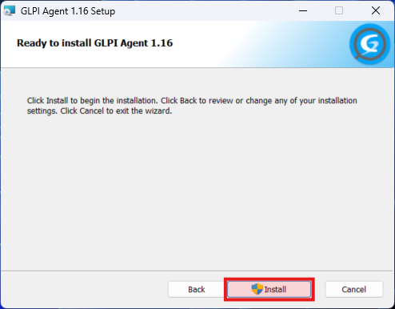

15. El proceso de instalación finalizará y nos mostrará el mensaje de que el asistente de instalación del Agente GLPI ha terminado. Para finalizar el asistente damos clic en el botón **Finish**.

:::info
El proceso puede llegar a tardar unos minutos en solicitar los permisos elevados y completarse la instalación.
:::

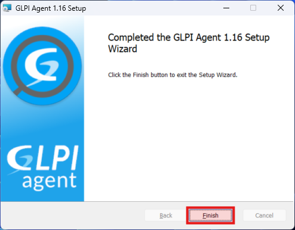

16. Con esto queda finalizado el asistente de instalación y la ventana se cerrará

### Método 2 - WinGet

:::info
Para hacer uso de esta herramienta en Windows 10 se requiere una versión superior a 22H2 y con el paquete Microsoft.DesktopAppInstaller
:::

1. Abre un CLI de Windows, puede ser **Windows** **PowerShell** o **Simbolo del sistema**. En Windows 10/11 presiona el atajo de teclado Windows + X para abrir el menú Windows.

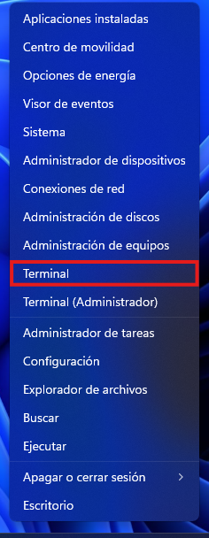

2. Nos mostrará una ventana con el prompt de Windows PowerShell.

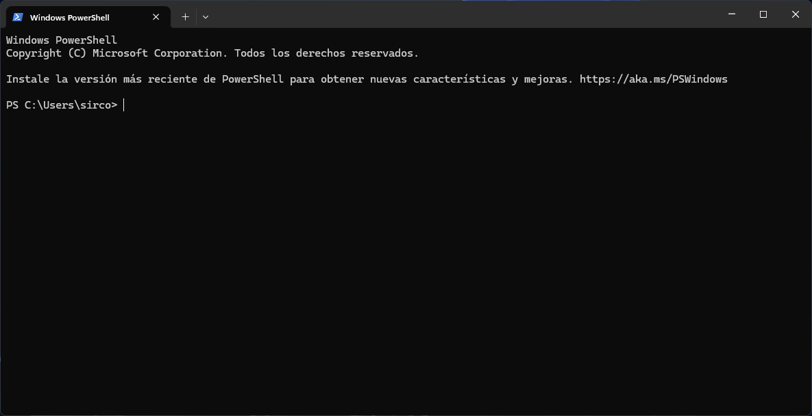

3. En el *prompt* escribimos el comando.

```powershell
winget install GLPI-Project.GLPI-Agent --custom="SERVER='https://glpi.creceenlace.com/' RUNNOW=1"
```

:::info
Si es la primera vez que hacemos una instalación usando WinGet es necesario aceptar la condiciones del servicio, solo es necesario tipear la tecla **Y**.
:::

4. Al momento de presionar la tecla *enter* nos mostrará el siguiente mensaje e indicación en el prompt de **Windows PowerShell.**

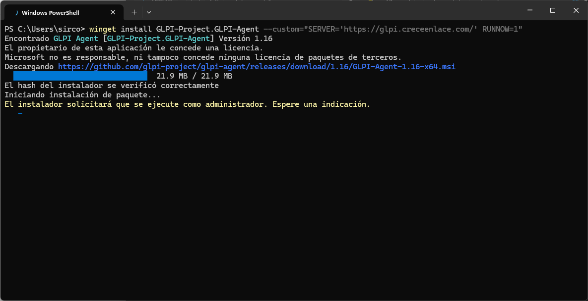

:::info
Al momento de ejecutar el instalador nos pedirá elevar a permisos de administrador.
:::

5. Al momento de elevar los permisos de administrador comenzará el proceso de instalación.

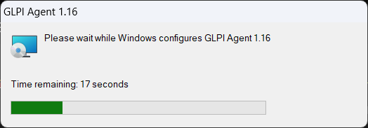

6. Una vez que finalice el instalador, este cerrará la ventana del instalador.

## Comprobación del estatus del agente

Una vez que ya tengamos instalado el agente en el equipo de cómputo del usuario.

1. Abrimos una ventana del navegador: Mozilla Firefox, Google Chrome, Microsoft Edge, etc.
2. En la barra de direcciones escribimos: localhost:62354
3. Nos mostrará la siguiente página.


4. Para validar que el servidor este dado de alta correctamente en nuestro agente, damos clic en el identificador del servidor. Para esta instancia es **server0.**

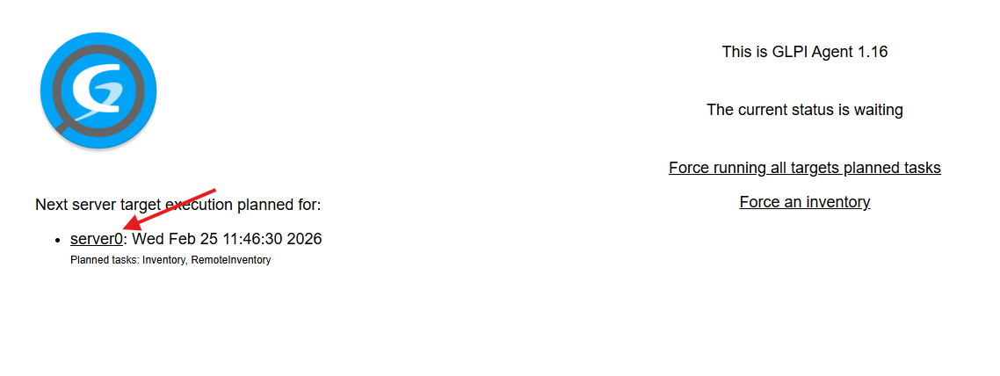

5. Nos debe de mostrar el inicio de sesión de nuestro servidor GLPI, así como lo demuestra la siguiente imagen.

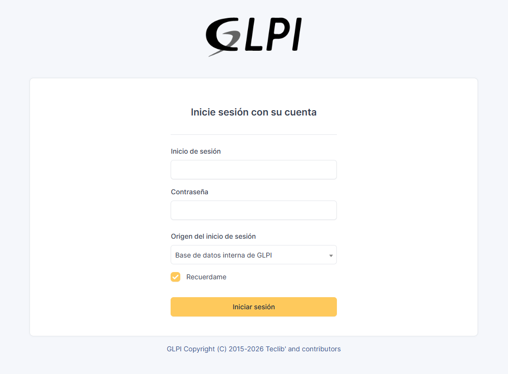

6. Una vez validado que apunte a nuestro servidor GLPI, podemos revisar el estatus del agente.
7. En la misma página del agente revisamos en la línea que indica el estatus actual.

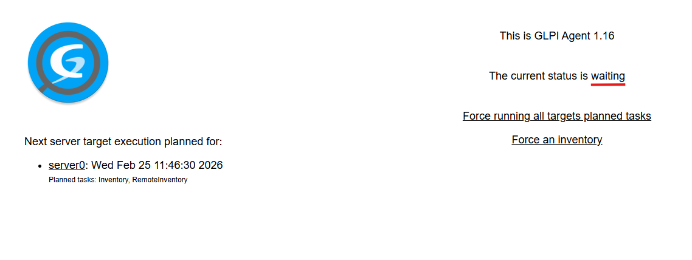

8. Si es **esperando** (waiting), significa que ya ha enviado el inventario del equipo al servidor de GLPI.
9. Podemos revisar cuando se ejecutara el siguiente envió de inventario a nuestro servidor en la línea donde aparece el identificador de nuestro servidor (server0).

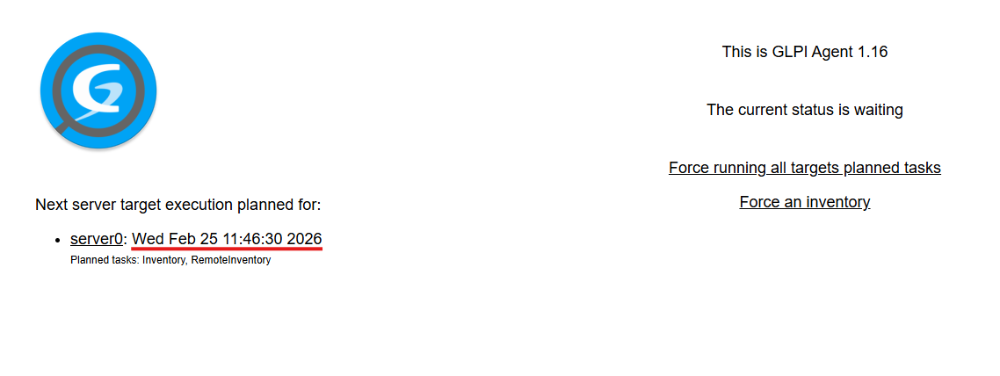

10. En caso de que aún no se haya enviado el inventario al servidor, podemos forzar que se realicen las tareas de inventario planeadas. Para ellos damos clic en el enlace **Force running all target planned tasks**.

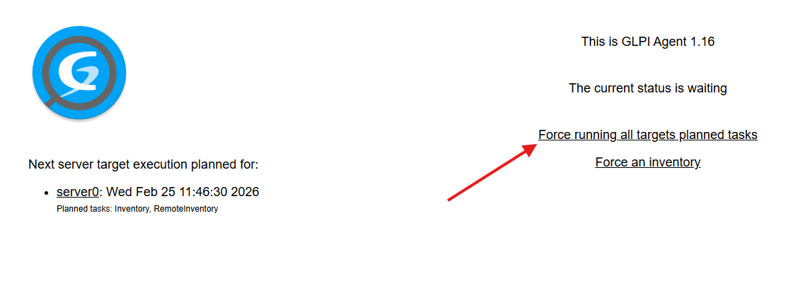

11. Nos mostrará la siguiente pantalla con un *OK*, para indicarnos que se ejecutaran las tareas de planeadas. Para regresar a la pantalla anterior damos clic en el enlace **Back**.


12. Ahora la página del agente nos mostrará el estatus **ejecutando** (running) una tarea planeada. Cómo en la imagen que muestra que esta corriendo la tarea de inventario.

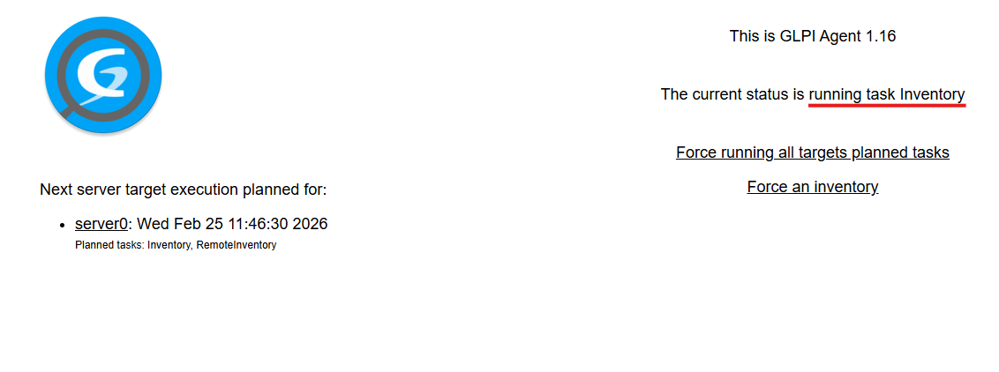

13. Con esto podemos comprobar que nuestro inventario se ha ejecutado y enviado a nuestro servidor GLPI.

## Posibles fallos

Recientemente nos percatamos que si se hace una copia del comando de WinGet se puede presentar un problema al pegarlo al CLI, incrustando un carácter de salto, por lo que se puede crear un error al momento de ingresar uno de los parámetros.